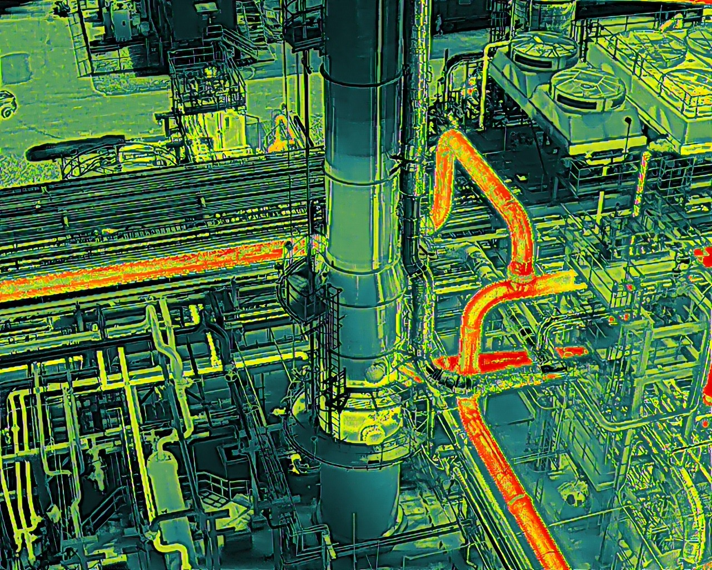

# DJI → FLIR Thermal Converter

> Convert DJI thermal R-JPEGs into FLIR-format radiometric JPEGs that open
> directly in **FLIR Tools**, **FLIR Thermal Studio**, and **ResearchIR**
> with full per-pixel temperature data intact.

Ships as a single double-clickable Windows `.exe`. No Python install, no
DJI SDK download, no command line. Pick a folder, get a folder.

---

## Example

| Before (DJI R-JPEG) | After (FLIR-format radiometric) |
| :---: | :---: |
|  |  |

The "after" file is a real FLIR-format R-JPEG that opens in FLIR Tools /
Thermal Studio / ResearchIR with the full radiometric stream intact.
Round-trip temperature error versus the DJI SDK's own decoded values is
**< 0.01 °C** on test M4T captures.

---

## The whole UI

1. Click **Convert a folder…**
2. Pick a folder of DJI photos (mixed visible + thermal + videos is fine).
3. Wait for the progress bar.
4. Output appears next to the source folder as `<folder name>_FLIR/`.

That's it. No checkboxes, no path-typing, no format pickers. Native
Windows look-and-feel (tkinter), runs entirely offline, ships in one
self-contained `.exe`.

**Supported cameras:** H30T, H20T, M30T, M3T, M4T, M4TD.

---

## Why this is technically non-trivial

DJI's and FLIR's thermal JPEGs are both "radiometric" — every pixel
encodes temperature, not just a color — but they use completely
different on-disk formats, and there's no published mapping between
their two calibration systems:

- **DJI** stores raw thermal data in a proprietary APP3 segment that
  only DJI's own SDK (`libdirp.dll`) can decode into temperatures. The
  decoder applies the camera's per-unit IIRP calibration internally.
- **FLIR** stores raw thermal data in an "FFF" container packed into
  one or more APP1 segments, alongside the Planck constants (`R1`,
  `B`, `F`, `O`, `R2`), atmospheric coefficients (`ATA1/2`, `ATB1/2`,
  `ATX`), and scene parameters (emissivity, object distance,
  reflected/atmospheric temperature, relative humidity) needed to
  recover temperature from the raw uint16 stream.

DJI's tools won't open FLIR files; FLIR's tools won't open DJI files.

**The catch that breaks the obvious approaches:** ExifTool, the
standard tool for editing image metadata, explicitly marks every FLIR
radiometric tag as `writable = 'false'` in `FLIR.pm`. You can read the
tags out of an existing FLIR file, but you cannot write them into one.
A naïve "extract DJI temperatures, write FLIR tags via ExifTool"
pipeline is impossible.

### The approach: template-shell with direct FFF binary patching

The converter uses a real FLIR R-JPEG (Thermimage's `IR_2412.jpg`, MIT
license) as a structural template. For each DJI input it:

1. **Extracts factory-grade temperatures.** Calls the DJI Thermal SDK
   v1.8 over a `ctypes` wrapper — this applies the camera's IIRP
   calibration that DJI Thermal Analysis Tool uses for display.
2. **Encodes the temperatures back to FLIR's raw uint16.** Re-runs the
   FLIR Planck equation (`temp2raw`) in reverse using the template's
   calibration. The forward equation is Thermimage's published form.
3. **Walks the JPEG segment chain** to extract the template's FLIR
   APP1 segments, concatenates their 8-byte-headered chunks back into
   a single FFF blob.
4. **Parses the FFF directory** (mixed-endian: BE header + index, LE
   record bodies), locates the `RawData` record (type `0x0001`) and
   the `CameraInfo` record (type `0x0020`).
5. **Patches RawData in place** with the new uint16 stream, then
   re-splits the FFF back into APP1-sized chunks (≤ 65520 bytes per
   the JPEG segment-length cap) and re-injects them into the JPEG
   bytestream.
6. **Patches CameraInfo's sensor dimensions** so FLIR Thermal Studio
   interprets the raw stream correctly when the DJI sensor size
   differs from the template's source camera.
7. **Writes pass-through EXIF/GPS** via a bundled ExifTool (only EXIF
   tags ExifTool *can* write — DateTimeOriginal, GPS, Model).

The CameraInfo block (Planck calibration, atmospherics, emissivity,
distance, reflected temperature, humidity) is left at the template's
values. That's deliberate — those parameters are exactly what FLIR
Tools / Thermal Studio expects to find, and the user can adjust them
post-hoc inside FLIR's software just like with a native FLIR capture.

If the SDK can't decode a particular file (corrupt input, or a camera
not yet in the v1.8 SDK's support list), the file is **flagged as an
error and skipped** rather than silently degraded — accuracy is the
whole point.

---

## Repo layout

```
DJI-to-FLIR/
├── main.py                    # tkinter UI (single window, three states)
├── build.spec                 # PyInstaller --onefile spec
├── requirements.txt
├── converter/
│   ├── pipeline.py            # folder-walk + per-file orchestration
│   ├── tsdk.py                # libdirp.dll ctypes wrapper (SDK v1.8)
│   ├── tier2_flir_jpeg.py     # FLIR R-JPEG binary builder (~925 lines)
│   ├── camera_profiles.py     # per-camera sensor metadata
│   ├── dji_app3.py            # APP3 raw-thermal segment reader (diagnostic)
│   ├── dji_iirp.py            # IIRP per-camera calibration reader
│   └── flir_format/
│       ├── planck.py          # temp ↔ raw uint16 (Thermimage formulas)
│       ├── tags.py            # FLIR EXIF/XMP tag names
│       └── template.jpg       # canonical FLIR R-JPEG template
└── examples/                  # before/after sample images
```

Files that don't ship in this public source repo (license / bulk
reasons; bundled at build time):
- `tsdk_dlls/` — DJI Thermal SDK v1.8 binaries (requires DJI dev account)
- `exiftool.exe` + `exiftool_files/` — ExifTool's Windows distribution

---

## Build instructions

The `.exe` end users run is built from this repo. To build it yourself:

### 1. Get the third-party dependencies

These are not in the repo:

**DJI Thermal SDK v1.8** — <https://www.dji.com/downloads/softwares/dji-thermal-sdk>
(free developer account). Unzip and copy everything from
`utility/bin/windows/release_x64/` into `tsdk_dlls/`.

**ExifTool (Windows)** — <https://exiftool.org>. Place `exiftool.exe`
in the project root and copy the `exiftool_files/` directory beside it.

### 2. Python environment

```powershell
python -m venv .venv
.venv\Scripts\pip install -r requirements.txt
```

### 3. Build the .exe

Always use the project venv's PyInstaller (the system Python
interpreter on most machines is missing required dependencies and
produces an .exe that crashes silently at startup):

```powershell
.venv\Scripts\pyinstaller.exe --clean --noconfirm build.spec
```

Output: `dist\DJI-to-FLIR.exe`. That single file is the deliverable —
everything the recipient needs is inside it.

### 4. Run from source (dev only)

```powershell
.venv\Scripts\python main.py
```

---

## Tech stack

- **Python 3.11+**, **NumPy**, **Pillow**, **piexif**
- **`ctypes`** for DJI Thermal SDK binding
- **tkinter** for the native UI (no browser, no FastAPI in this build)
- **PyInstaller `--onefile`** for self-contained Windows distribution

The conversion engine is pure Python plus a thin `ctypes` shim over
DJI's C SDK. No Pillow-style "auto-magic" — every byte that ends up in
the output FFF container is deliberately written.

---

## References

- **Thermimage** (R, G. Tattersall, GPL-3) — Planck equation
  reference and source of the canonical `IR_2412.jpg` template:
  <https://github.com/gtatters/Thermimage>
- **flirpy** (LJMU Astroecology) — working FLIR R-JPEG reader, useful
  for cross-checking: <https://github.com/LJMUAstroecology/flirpy>
- **ExifTool FLIR.pm** — canonical reference for FLIR's tag names:
  <https://exiftool.org/TagNames/FLIR.html>
- **kentavv/flir-batch-process** — another working FLIR R-JPEG
  processor, useful for edge-case sanity checks:
  <https://github.com/kentavv/flir-batch-process>

---

## License

MIT — see [LICENSE](LICENSE).

DJI Thermal SDK and ExifTool are not redistributed in this repo; they
are pulled in at build time on the developer's machine. The end-user
.exe bundles them under their respective licenses.
